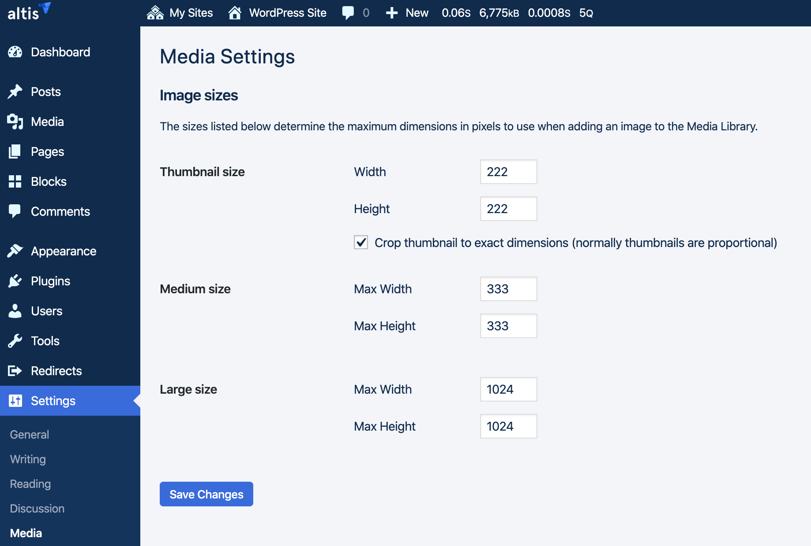
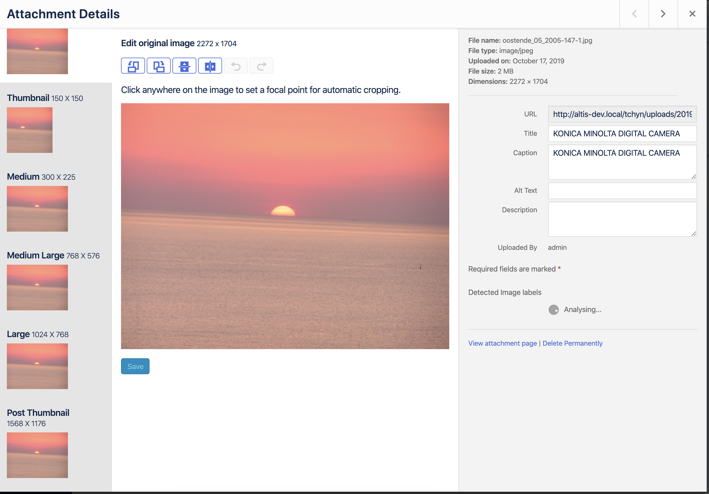

# Defining Image Sizes

Altis provides some default image sizes, that you can use to render images in the theme.

- Thumbnail
- Medium
- Large
- Post Thumbnail
- Full

They have default dimensions, but you can override these either with code or in the admin, under [Settings > Media](internal://admin/options-media.php).



A lot of times, you'll find that you need custom image sizes for different contexts, depending on your theme's design.

You can define custom image sizes with the `add_image_size()` function.

This function accepts the following parameters:

```php
 * @param string     $name   Image size identifier.
 * @param int        $width  Optional. Image width in pixels. Default 0.
 * @param int        $height Optional. Image height in pixels. Default 0.
 * @param bool|array $crop   Optional. Whether to crop images to specified width and height or resize.
```
The custom image sizes should be declared in the callback function to the `after_setup_theme` action.

Example:
```php
add_action( 'after_setup_theme', 'theme_setup' );
function theme_setup() {
	// Set the image size by resizing the image while maintaining the aspect ratio:
	add_image_size( 'custom-size', 220, 180 ); // Image constrained to 220 pixels wide by 180 pixels tall
	
	// Set the image size by cropping the image (not showing part of it):
	add_image_size( 'custom-size', 220, 180, true ); // Exactly 220 pixels wide by 180 pixels tall
	
	// Set the image size by cropping the image and defining a crop position:
	add_image_size( 'custom-size', 220, 220, [ 'left', 'top' ] ); // Hard crop left top
}
```

Custom images sizes do not show up in the editor by default when editing image blocks. See the [Hooks and Filters section](#hooks-and-filters) below to find out how to do this.

### Cropping

Cropping behavior for the image size is dependent on the value of `$crop`:
1. If false (default), images will be scaled, not cropped.
2. If an array in the form of `[ x_crop_position, y_crop_position ]`:
    - x_crop_position accepts 'left' 'center', or 'right'.
    - y_crop_position accepts 'top', 'center', or 'bottom'.
    Images will be cropped to the specified dimensions within the defined crop area.
 3. If true, images will be cropped to the specified dimensions using center positions.
 
You can find more info in the [WordPress developer guide](https://developer.wordpress.org/themes/functionality/featured-images-post-thumbnails/#add-custom-featured-image-sizes)

## Using The Custom Sizes

Once you've defined custom image sizes, there are different ways you can use them.

You can display a post thumbnail:

```php
// Output the post thumbnail image tag:
the_post_thumbnail( 'custom-size` );
```

You can display any uploaded image by its attachment ID:

```php
$src = wp_get_attachment_image_src( $attachment_id , 'custom-size' );
$img_url = $src[0];
echo ( ! empty( $img_url ) ) ? $img_url : '';
```

## Hooks And Filters

### `image_size_names_choose`

This filter allows you to make your custom image sizes available for selection in the admin.

Runs before rendering the list of available image sizes in the sidebar of the media edit screen. Used in conjuction with `add_image_size` 

```php
add_filter( 'image_size_names_choose', function ( array $sizes ) : array {
	$sizes['category-thumb'] = __( 'Category Thumb' );
	return $sizes;
});
```



You can find the [full documentation for this filter here](https://developer.wordpress.org/reference/hooks/image_size_names_choose/).

## Dynamically Defined With A Size Array

In cases where a specific image size might only be used once you can define the image size via an array of width and height values in pixels:

```php
$thumb_url = wp_get_attachment_image_src( $attachment_id, [ 900, 450 ], true );`
```


**NOTE**: This method of defining dimensions currently does not support cropping.
