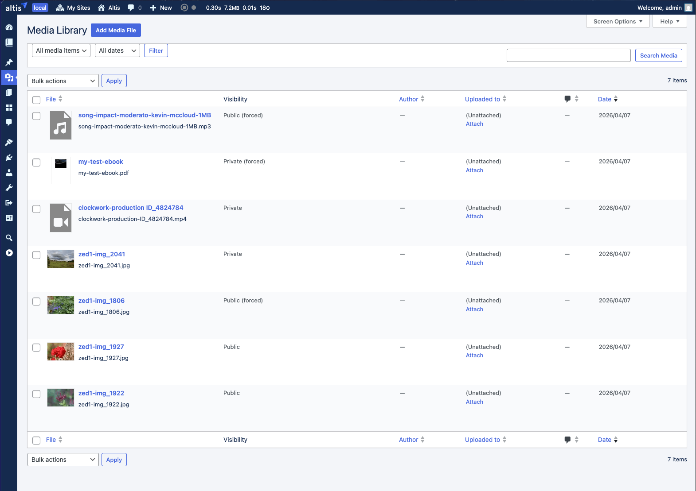
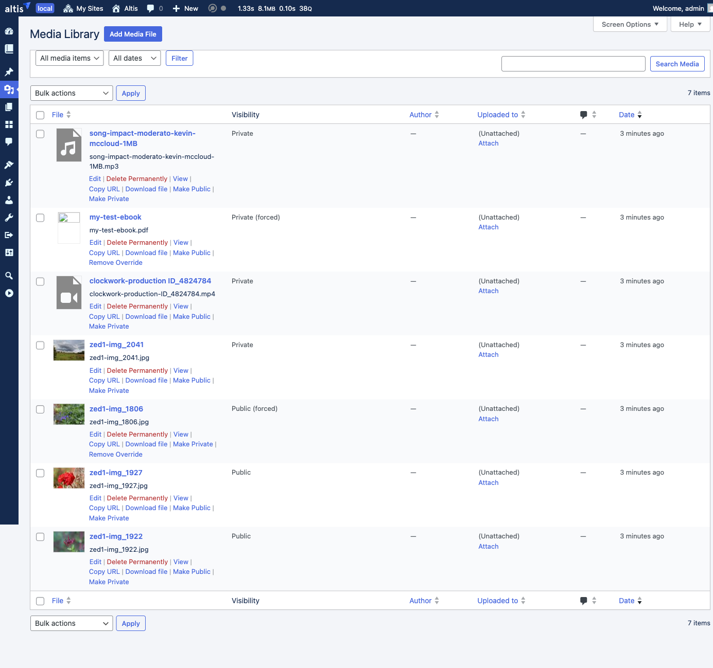

# Private Media

The Private Media feature makes uploaded media **private by default**. When you upload an image, video, PDF or any other file to
the media library, it cannot be accessed by visitors via its direct URL. The file only becomes publicly accessible when it is used
in published content, or when you choose to make it public manually.

This prevents uploaded media from being discoverable or shareable before the content it belongs to has been published.

Private Media is enabled by default for all sites except the Global Media Library site. It can be disabled via configuration:

```json
{
    "extra": {
        "altis": {
            "modules": {
                "media": {
                    "private-media": false
                }
            }
        }
    }
}
```

## How It Works

### Uploads Are Private by Default

When you upload a file to the media library it starts as private. Anyone trying to access the file via its direct URL will receive
an access denied error. Under the hood, this is implemented by setting the file's S3 storage permissions to private.

Private files are still fully available to logged-in users who can upload media (authors, editors and administrators). You can
browse them in the media library, insert them into posts, and use them as featured images as normal.

### Files Become Public When Content Is Published

When you publish a post or page, all the media used in it automatically becomes publicly accessible:

- Images, videos and files embedded in the content are detected.
- The featured image (post thumbnail) is included.
- The files' storage permissions are updated so they can be accessed by visitors.

If the same file is used in more than one published post, it stays public until all of those posts are unpublished.

### Files Return to Private When Content Is Unpublished

When you move a published post back to draft, trash it, or otherwise unpublish it:

- All files that were referenced by that post are re-evaluated.
- If a file is no longer used by any published post (and you haven't manually set it to public), it returns to private.

The same re-evaluation happens when you edit a published post and remove an image from its content.

## What You See in the Media Library

### The Visibility Column

The media library list view includes a **Visibility** column that shows the current access status of each file:



The possible statuses are:

- **Private** — the default. The file cannot be accessed via its direct URL.
- **Public** — the file is used in published content and can be accessed by visitors.
- **Public (forced)** — you have manually set this file to always be public, regardless of whether it is used in published content.
- **Private (forced)** — you have manually set this file to always be private, even if it is used in published content.

### Changing Visibility with Quick Actions

Hover over any file in the media library list to see the available quick actions:



- **Make Public** — makes the file publicly accessible, even if it is not used in any published content.
- **Make Private** — makes the file private, even if it is currently used in published content.
- **Remove Override** — removes your manual setting and returns the file to automatic management (appears after you have used Make
  Public or Make Private).

<!-- TODO: Add screenshot of success notice after changing visibility (assets/private-media-notice.png) -->

### Changing Visibility for Multiple Files

To change the visibility of several files at once:

1. Select the files using the checkboxes in the media library list.
2. Choose **Set Visibility** from the **Bulk actions** dropdown.
3. Click **Apply**.
4. On the confirmation screen, choose the target visibility and click **Apply**.

<!-- TODO: Add screenshot of the bulk action confirmation screen (assets/private-media-bulk-confirm.png) -->

### Changing Visibility in the Media Editor

When editing a post, click on a file in the media browser to see its details in the sidebar. The **Visibility Override** dropdown
lets you change the visibility setting directly without leaving the editor.

<!-- TODO: Add screenshot of the media modal sidebar showing visibility dropdown (assets/private-media-modal-sidebar.png) -->

The sidebar also shows:

- The current access status of the file.
- Which published posts are using the file (if any).
- Whether the file is a legacy (pre-migration) upload.

## Managing Post Attachments

Posts and pages in the admin list include two additional quick actions for working with their media:

- **Publish image(s)** — scans the post content and ensures all files used in it are publicly accessible. Useful if images appear
  broken after a migration or configuration change.
- **Unpublish image(s)** — removes the post's association with its files, which may cause them to become private if no other
  published posts use them.

<!-- TODO: Add screenshot of post list row actions showing Publish/Unpublish image(s) (assets/private-media-post-actions.png) -->

## Previewing Draft Content

When you preview a draft post, private images in the content are displayed using temporary signed URLs that expire after a short
period. This means you can see exactly how the post will look without needing to make the images public first.

## Existing Uploads and Migration

When Private Media is first enabled on a site that already has uploaded files, all existing files remain publicly accessible. They
are marked as "legacy" uploads so they continue to work without disruption.

To apply this marking, run the migration command after enabling the feature:

```
wp private-media migrate
```

Use `--dry-run` to preview what would change without making any modifications.

## Site Icon

The site icon (favicon) is always treated as public, since it needs to be accessible on every page. This applies automatically
when you set a site icon in **Settings > General**. If you specifically force the site icon to private, that override takes
precedence.

## Configuration

### Disabling the Feature

Set `private-media` to `false` in your Altis configuration to disable the feature entirely. When disabled, a compatibility layer
remains active to ensure any files that were previously set to private status are still included in media queries, preventing
them from disappearing.

### Adding Custom Post Types

By default, all post types that support the content editor are tracked for media references. If you have a custom post type that
uses media but does not register editor support, you can include it:

```php
add_filter( 'private_media/allowed_post_types', function ( array $types ) : array {
    $types[] = 'my_custom_type';
    return $types;
} );
```

### Registering Custom Image Fields

If your theme or plugin stores file IDs in custom fields (similar to how WordPress stores the featured image), you can register
those field names so they are included when scanning a post for media references:

```php
add_filter( 'private_media/post_meta_attachment_keys', function ( array $keys ) : array {
    $keys[] = '_custom_header_image_id';
    $keys[] = '_secondary_image_id';
    return $keys;
} );
```

### Adding Custom Media Sources

For more advanced cases where files are associated with posts through non-standard means, you can add additional file IDs to the
scan results:

```php
add_filter( 'private_media/post_attachment_ids', function ( array $ids, WP_Post $post ) : array {
    // Include files from a custom gallery field.
    $gallery_ids = get_post_meta( $post->ID, '_gallery_images', true );
    if ( is_array( $gallery_ids ) ) {
        $ids = array_merge( $ids, $gallery_ids );
    }
    return $ids;
}, 10, 2 );
```

## WP-CLI Commands

The following commands are available for managing private media from the command line. All commands support `--dry-run` to preview
changes without applying them.

### Migrate Existing Uploads

```
wp private-media migrate [--dry-run]
```

Marks all existing uploads as legacy (public) and ensures their status is correct. Run this when first enabling Private Media on a
site with existing content.

### Set Visibility for a Specific File

```
wp private-media set-visibility <public|private> <id|filename> [--dry-run]
```

Manually set the visibility for a specific file by its ID or filename.

### Fix Inconsistencies

```
wp private-media fix-attachments [--start-date=<date>] [--end-date=<date>] [--dry-run] [--verbose]
```

Re-evaluates the visibility of all files, correcting any inconsistencies. Supports date range filtering for targeted fixes.

## Hooks and Filters Reference

| Filter                                    | Description                                                               |
|-------------------------------------------|---------------------------------------------------------------------------|
| `private_media/allowed_post_types`        | Array of post types to track for media references.                        |
| `private_media/post_meta_attachment_keys` | Array of field names that store file IDs (like the featured image field). |
| `private_media/post_attachment_ids`       | Array of file IDs found in a post. Receives `$ids` and `$post`.           |
| `private_media/update_s3_acl`             | Intercept storage permission updates. Return non-null to short-circuit.   |
| `private_media/purge_cdn_cache`           | Intercept CDN cache clearing. Return non-null to short-circuit.           |
