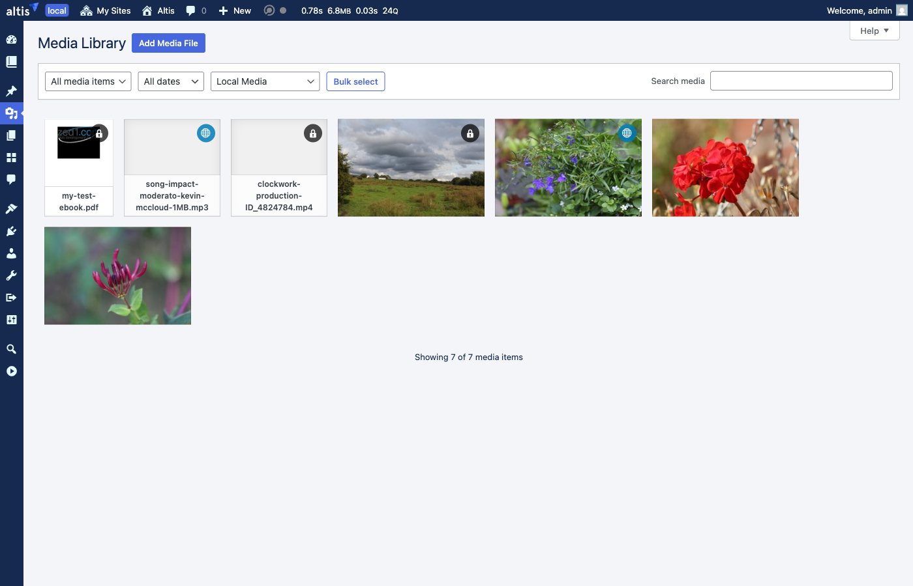
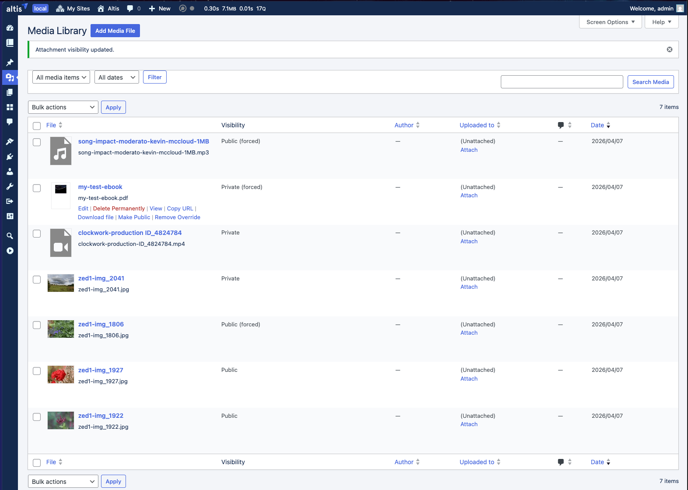
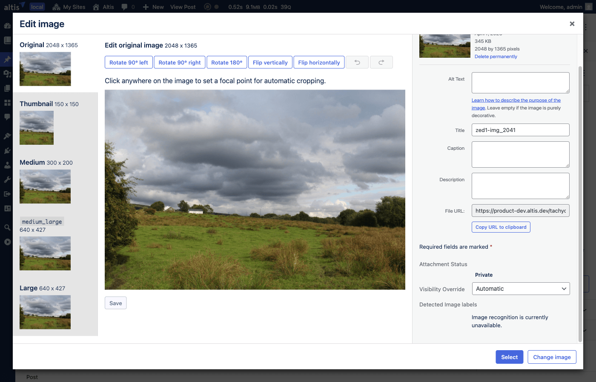
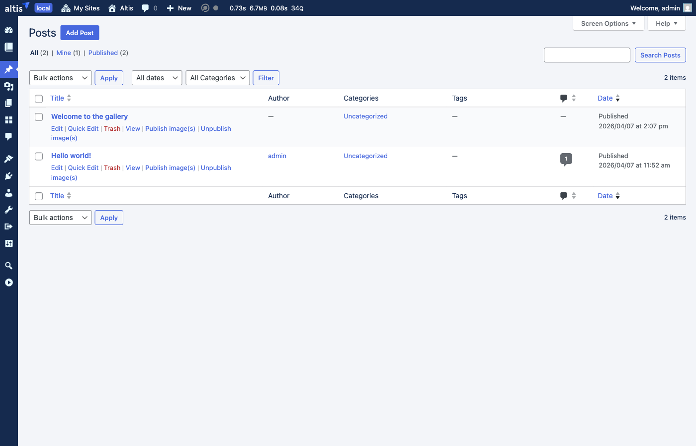

# Private Media

The Private Media feature makes uploaded media **private by default**. When you upload an image, video, PDF or any other file to
the media library, it cannot be accessed by visitors via its direct URL. The file only becomes publicly accessible when it is used
in published content, or when you choose to make it public manually.

This prevents uploaded media from being discoverable or shareable before the content it belongs to has been published.

Private Media is opt-in. Enable it by adding the following to your `composer.json`:

```json
{
    "extra": {
        "altis": {
            "modules": {
                "media": {
                    "private-media": true
                }
            }
        }
    }
}
```

Note: The feature is always off on the Global Media Library site.

## How It Works

### Uploads Are Private by Default

When you upload a file to the media library it starts as private. Anyone trying to access the file via its direct URL will receive
an access denied error. Under the hood, this is implemented by setting the file's S3 storage permissions to private.

Private files are still fully available to logged-in users who can upload media (authors, editors and administrators). You can
browse them in the media library, insert them into posts, and use them as featured images as normal.

This protection also covers the front-end attachment page (e.g. `/my-image/`). For a private attachment, that page returns a
404 for visitors who can't edit the file.

### Files Become Public When Content Is Published

When you publish a post or page, all the media used in it automatically becomes publicly accessible:

- Images, videos, audio and files embedded in the content are detected.
- The featured image (post thumbnail) is included.
- The files' storage permissions are updated so they can be accessed by visitors.

If the same file is used in more than one published post, it will become public when the first post is made public. It will stay 
public until all of those posts are unpublished.

### Files Return to Private When Content Is Unpublished

When you move a published post back to draft, trash it, or otherwise unpublish it:

- All files that were referenced by that post are re-evaluated.
- If a file is no longer used by any published post (and you haven't manually set it to public), it returns to private.

The same re-evaluation happens when you edit a published post and remove an image from its content.

## What You See in the Media Library

### Grid View Badges

The media library opens in grid view by default. Small icon badges in the top-right corner of each thumbnail indicate visibility
at a glance:



- **Lock icon** (dark badge) — the file is private. This is the most common badge since new uploads start as private.
- **Globe icon** (blue badge) — the file has been manually forced public.
- **No badge** — the file is naturally public because it is used in published content. This is the expected state for published
  media, so no badge is shown.

To change the visibility of a file from the grid view, click its thumbnail to open the attachment details panel, then use the
**Visibility Override** dropdown — see [Changing Visibility in the Media Browser](#changing-visibility-in-the-media-browser)
below.

### List View — the Visibility Column

If you switch the media library to list view, a **Visibility** column shows the current visibility of each file:


The possible statuses are:

- **Private** — the default. The file cannot be accessed via its direct URL.
- **Public** — the file is used in published content and can be accessed by visitors.
- **Public (forced)** — you have manually set this file to always be public, regardless of whether it is used in published content.
- **Private (forced)** — you have manually set this file to always be private, even if it is used in published content.

### Changing Visibility with Quick Actions (List View)

Hover over any row in list view to see the available quick actions:


- **Make Public** — makes the file publicly accessible, even if it is not used in any published content.
- **Make Private** — makes the file private, even if it is currently used in published content.
- **Restore Default Visibility** — removes your manual setting and returns the file to automatic management. This only appears 
  after you have used Make Public or Make Private).

After changing visibility, a confirmation notice appears at the top of the screen:



### Changing Visibility for Multiple Files

To change the visibility of several files at once:

1. Switch the media library to list view.
2. Select the files using the checkboxes.
3. From the **Bulk actions** dropdown, choose one of the **Set Visibility** options — "Public", "Private", or "Automatic".
4. Click **Apply**.

### Changing Visibility in the Media Browser

When editing a post, open the media browser (for example, by inserting an Image block and choosing **Media Library**) and click
any file. The attachment details sidebar includes a **Visibility Override** dropdown that lets you change the visibility setting
without leaving the editor.



The sidebar also shows:

- The current access status of the file.
- Which published posts are using the file (if any).

## Managing Post Attachments

Posts and pages in the admin list include an extra **Rescan attachment visibility** row action. It runs through the post's
content, re-records which attachments it references, and re-evaluates each one — published posts make their attachments public,
anything else makes them private unless another published post still uses them. Useful if images appear broken after a migration, an
import, or a configuration change that bypassed the normal publish/unpublish lifecycle.



## Previewing Draft Content

When you preview a draft post, private images in the content are displayed using temporary signed URLs that expire after a short
period. This means you can see exactly how the post will look without needing to make the images public first. Note: this also
means if you leave a preview tab open in your browser, the images in it will eventually stop working as the signed URLs expire. Just
refresh the preview to get new URLs.

## Existing Uploads

When Private Media is first enabled on a site that already has uploaded files, all existing files remain publicly accessible — no
migration step is needed. The visibility check treats any attachment that lacks the `_altis_media_acl` post meta as public, so
files uploaded before the feature was enabled are unaffected. From the moment the feature turns on, every new upload writes the
meta and is managed by the rules above.

## Site Icon

The site icon (favicon) is always treated as public, since it needs to be accessible on every page. This applies automatically
when you set a site icon in **Settings > General**. If you specifically force the site icon to private, that override takes
precedence.

## Configuration

### Enabling the Feature

Set `private-media` to `true` in your Altis configuration to turn the feature on. The feature is off by default and leaves no
runtime footprint when not enabled: attachments stay at WordPress's default `inherit` status and the `_altis_media_acl` post meta
that records each file's S3 ACL state is simply ignored. Toggling the feature off and back on is non-destructive, But note, any 
media currently set to private will remain private in the underlying S3 storage.

The `wp private-media …` commands described below are only registered while the feature is enabled.

### Adding Custom Post Types

By default, all post types that support the content editor are tracked for media references. If you have a custom post type that
uses media but does not register editor support, you can include it:

```php
add_filter( 'altis.media.private_media.allowed_post_types', function ( array $types ) : array {
    $types[] = 'my_custom_type';
    return $types;
} );
```

### Registering Custom Image Fields

If your theme or plugin stores file IDs in custom fields (similar to how WordPress stores the featured image), you can register
those field names so they are included when scanning a post for media references:

```php
add_filter( 'altis.media.private_media.post_meta_attachment_keys', function ( array $keys ) : array {
    $keys[] = '_custom_header_image_id';
    $keys[] = '_secondary_image_id';
    return $keys;
} );
```

### Adding Custom Media Sources

For more advanced cases where files are associated with posts through non-standard means, you can add additional file IDs to the
scan results:

```php
add_filter( 'altis.media.private_media.post_attachment_ids', function ( array $ids, int $post_id, WP_Post $post ) : array {
    // Include files from a custom gallery field.
    $gallery_ids = get_post_meta( $post->ID, '_gallery_images', true );
    if ( is_array( $gallery_ids ) ) {
        $ids = array_merge( $ids, $gallery_ids );
    }
    return $ids;
}, 10, 3 );
```

## WP-CLI Commands

Two commands are available for managing private media from the command line. Both support `--dry-run` to preview what
would change without applying anything.

### Which command should I use?

| Situation                                                                    | Command                                                                             |
|------------------------------------------------------------------------------|-------------------------------------------------------------------------------------|
| Force a single file public or private (or remove an override) from the shell | [`set_visibility`](#set-visibility-for-a-specific-file)                             |
| Repair drift after a content import, an SQL edit, or a filter change         | [`fix_attachments`](#repair-attachment-references)                                  |
| Bulk-rescan all media used by a single post                                  | Use the **Rescan attachment visibility** row action in the Posts list (UI), not CLI |

### Set Visibility for a Specific File

```shell
wp private-media set_visibility <public|private> <id|filename> [--dry-run]
```

Sets a manual visibility override on a single attachment, equivalent to using the **Make Public** / **Make Private** row actions
in the media library. The override takes absolute precedence over the automatic publish/unpublish lifecycle: a forced-private
attachment stays private even if it's used in a published post, and a forced-public attachment stays public even if no post
references it.

The attachment can be identified by its numeric ID or by filename:

```
wp private-media set_visibility public 123
wp private-media set_visibility private my-document.pdf
wp private-media set_visibility public 123 --dry-run
```

To **remove** an override and return an attachment to automatic management, use the **Restore Default Visibility** row action in the
media library — there is currently no CLI equivalent.

### Repair Attachment References

```
wp private-media fix_attachments [--start-date=<date>] [--end-date=<date>] [--dry-run] [--verbose]
```

Walks every published post in the given date range, re-scans its content for attachment references, and reconciles the visibility
state of each referenced attachment. For each post it:

1. Calls `get_post_attachment_ids()` to find every attachment used in the post — image blocks, the featured image, video posters,
   custom fields registered via the `altis.media.private_media.post_attachment_ids` filter, etc.
2. Re-records each post → attachment reference (`add_post_reference`).
3. Recomputes the correct visibility for each attachment based on its current overrides plus its full reference list, and applies
   the result (ACL meta update + S3 ACL).
4. Stores the fresh attachment-ID list back on the post in the `altis_private_media_post` meta.

This is a **repair tool**, not part of the normal lifecycle. Reach for it when:

- A bulk content import didn't fire `transition_post_status` and attachments are stuck private.
- Someone edited posts via SQL or a script that bypassed WordPress hooks.
- You changed `altis.media.private_media.allowed_post_types`, `altis.media.private_media.post_meta_attachment_keys`, or `altis.media.private_media.post_attachment_ids`
  and want existing posts to be re-scanned with the new configuration.
- The "used in" reference list on attachments has drifted out of sync with reality.

The default date range is the **last 30 days based on post date** (not modified date — so this won't catch posts that were
imported with an old date but published recently). Override with `--start-date` and `--end-date`:

```shell
# Preview a single day
wp private-media fix_attachments --start-date=2026-04-01 --end-date=2026-04-01 --dry-run

# Repair the whole of last month, with per-post detail
wp private-media fix_attachments --start-date=2026-03-01 --end-date=2026-03-31 --verbose

# Repair everything (use a wide range)
wp private-media fix_attachments --start-date=2000-01-01 --end-date=2099-12-31
```

`--verbose` prints one line per post showing how many attachments were found.

## Hooks and Filters Reference

| Filter                                    | Description                                                               |
|-------------------------------------------|---------------------------------------------------------------------------|
| `altis.media.private_media.allowed_post_types`        | Array of post types to track for media references.                        |
| `altis.media.private_media.post_meta_attachment_keys` | Array of field names that store file IDs (like the featured image field). |
| `altis.media.private_media.post_attachment_ids`       | Array of file IDs found in a post. Receives `$ids`, `$post_id`, and `$post`. |
| `altis.media.private_media.s3_acl`                    | Filter the S3 ACL string before it is applied. Return an empty string to skip the S3 call. |

| Action                                                          | Description                                                                                                              |
|-----------------------------------------------------------------|--------------------------------------------------------------------------------------------------------------------------|
| `altis.media.private_media.attachment_visibility_changed`       | Fired after an attachment's `_altis_media_acl` meta has been updated. Default consumers update the S3 ACL and invalidate the CDN cache. Receives `$attachment_id` and `$new_acl`. |
