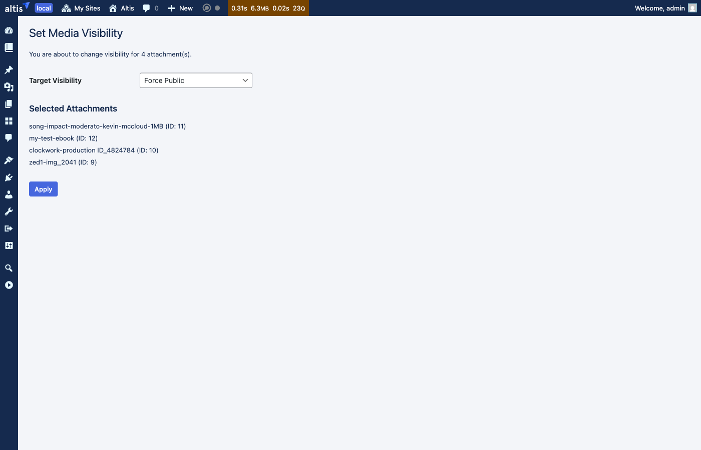

# Private Media

The Private Media feature makes uploaded media **private by default**. When you upload an image, video, PDF or any other file to
the media library, it cannot be accessed by visitors via its direct URL. The file only becomes publicly accessible when it is used
in published content, or when you choose to make it public manually.

This prevents uploaded media from being discoverable or shareable before the content it belongs to has been published.

Private Media is enabled by default for all sites except the Global Media Library site. It can be disabled via configuration:

```json
{
    "extra": {
        "altis": {
            "modules": {
                "media": {
                    "private-media": false
                }
            }
        }
    }
}
```

## How It Works

### Uploads Are Private by Default

When you upload a file to the media library it starts as private. Anyone trying to access the file via its direct URL will receive
an access denied error. Under the hood, this is implemented by setting the file's S3 storage permissions to private.

Private files are still fully available to logged-in users who can upload media (authors, editors and administrators). You can
browse them in the media library, insert them into posts, and use them as featured images as normal.

### Files Become Public When Content Is Published

When you publish a post or page, all the media used in it automatically becomes publicly accessible:

- Images, videos, audio and files embedded in the content are detected.
- The featured image (post thumbnail) is included.
- The files' storage permissions are updated so they can be accessed by visitors.

If the same file is used in more than one published post, it stays public until all of those posts are unpublished.

### Files Return to Private When Content Is Unpublished

When you move a published post back to draft, trash it, or otherwise unpublish it:

- All files that were referenced by that post are re-evaluated.
- If a file is no longer used by any published post (and you haven't manually set it to public), it returns to private.

The same re-evaluation happens when you edit a published post and remove an image from its content.

## What You See in the Media Library

### Grid View Badges

The media library opens in grid view by default. Small icon badges in the top-right corner of each thumbnail indicate visibility
at a glance:


- **Lock icon** (dark badge) — the file is private. This is the most common badge since new uploads start as private.
- **Globe icon** (blue badge) — the file has been manually forced public.
- **No badge** — the file is naturally public because it is used in published content. This is the expected state for published
  media, so no badge is shown to keep the grid clean.

To change the visibility of a file from grid view, click its thumbnail to open the attachment details panel, then use the
**Visibility Override** dropdown — see [Changing Visibility in the Media Browser](#changing-visibility-in-the-media-browser)
below.

### List View — the Visibility Column

If you switch the media library to list view, a **Visibility** column shows the current access status of each file in plain text:


The possible statuses are:

- **Private** — the default. The file cannot be accessed via its direct URL.
- **Public** — the file is used in published content and can be accessed by visitors.
- **Public (forced)** — you have manually set this file to always be public, regardless of whether it is used in published content.
- **Private (forced)** — you have manually set this file to always be private, even if it is used in published content.

### Changing Visibility with Quick Actions (List View)

Hover over any row in list view to see the available quick actions:


- **Make Public** — makes the file publicly accessible, even if it is not used in any published content.
- **Make Private** — makes the file private, even if it is currently used in published content.
- **Remove Override** — removes your manual setting and returns the file to automatic management (appears after you have used Make
  Public or Make Private).

After changing visibility, a confirmation notice appears at the top of the screen:


### Changing Visibility for Multiple Files

To change the visibility of several files at once:

1. Switch the media library to list view.
2. Select the files using the checkboxes.
3. Choose **Set Visibility** from the **Bulk actions** dropdown.
4. Click **Apply**.
5. On the confirmation screen, choose the target visibility and click **Apply**.



### Changing Visibility in the Media Browser

When editing a post, open the media browser (for example, by inserting an Image block and choosing **Media Library**) and click
any file. The attachment details sidebar includes a **Visibility Override** dropdown that lets you change the visibility setting
without leaving the editor.


The sidebar also shows:

- The current access status of the file.
- Which published posts are using the file (if any).
- Whether the file is a legacy (pre-migration) upload.

## Managing Post Attachments

Posts and pages in the admin list include two additional quick actions for working with their media:


- **Publish image(s)** — scans the post content and ensures all files used in it are publicly accessible. Useful if images appear
  broken after a migration or configuration change.
- **Unpublish image(s)** — removes the post's association with its files, which may cause them to become private if no other
  published posts use them.

## Previewing Draft Content

When you preview a draft post, private images in the content are displayed using temporary signed URLs that expire after a short
period. This means you can see exactly how the post will look without needing to make the images public first.

## Existing Uploads and Migration

When Private Media is first enabled on a site that already has uploaded files, all existing files remain publicly accessible. They
are marked as "legacy" uploads so they continue to work without disruption.

To apply this marking, run the migration command after enabling the feature:

```
wp private-media migrate
```

Use `--dry-run` to preview what would change without making any modifications.

## Site Icon

The site icon (favicon) is always treated as public, since it needs to be accessible on every page. This applies automatically
when you set a site icon in **Settings > General**. If you specifically force the site icon to private, that override takes
precedence.

## Configuration

### Disabling the Feature

Set `private-media` to `false` in your Altis configuration to disable the feature entirely. When disabled, a compatibility layer
remains active to ensure any files that were previously set to private status are still included in media queries, preventing
them from disappearing.

### Adding Custom Post Types

By default, all post types that support the content editor are tracked for media references. If you have a custom post type that
uses media but does not register editor support, you can include it:

```php
add_filter( 'private_media/allowed_post_types', function ( array $types ) : array {
    $types[] = 'my_custom_type';
    return $types;
} );
```

### Registering Custom Image Fields

If your theme or plugin stores file IDs in custom fields (similar to how WordPress stores the featured image), you can register
those field names so they are included when scanning a post for media references:

```php
add_filter( 'private_media/post_meta_attachment_keys', function ( array $keys ) : array {
    $keys[] = '_custom_header_image_id';
    $keys[] = '_secondary_image_id';
    return $keys;
} );
```

### Adding Custom Media Sources

For more advanced cases where files are associated with posts through non-standard means, you can add additional file IDs to the
scan results:

```php
add_filter( 'private_media/post_attachment_ids', function ( array $ids, int $post_id, WP_Post $post ) : array {
    // Include files from a custom gallery field.
    $gallery_ids = get_post_meta( $post->ID, '_gallery_images', true );
    if ( is_array( $gallery_ids ) ) {
        $ids = array_merge( $ids, $gallery_ids );
    }
    return $ids;
}, 10, 3 );
```

## WP-CLI Commands

Three commands are available for managing private media from the command line. All of them support `--dry-run` to preview what
would change without applying anything.

### Which command should I use?

| Situation                                                                            | Command                                       |
|--------------------------------------------------------------------------------------|-----------------------------------------------|
| First-time enable on a site that already has uploaded files                          | [`migrate`](#migrate-existing-uploads)        |
| Force a single file public or private (or remove an override) from the shell         | [`set_visibility`](#set-visibility-for-a-specific-file) |
| Repair drift after a content import, an SQL edit, or a filter change                 | [`fix_attachments`](#repair-attachment-references) |
| Bulk-publish all media used by a single post                                         | Use the **Publish image(s)** row action in the Posts list (UI), not CLI |

### Migrate Existing Uploads

```
wp private-media migrate [--dry-run]
```

A **one-time** command for sites that already had uploaded files before Private Media was enabled. It walks every existing
attachment and:

1. Marks it as legacy by setting `legacy_attachment` in its metadata. Legacy attachments stay publicly accessible regardless of
   whether they appear in any published post — they predate the feature, so the system doesn't try to retroactively decide
   whether they "should" be private.
2. Sets its `post_status` to `publish`.
3. Updates the file's S3 ACL to `public-read`.

You should run this **once**, immediately after enabling Private Media on a site with existing content. Running it a second time
is harmless but unnecessary — there will be nothing left to migrate.

Use `--dry-run` first to see how many attachments would be touched.

```
wp private-media migrate --dry-run
wp private-media migrate
```

### Set Visibility for a Specific File

```
wp private-media set_visibility <public|private> <id|filename> [--dry-run]
```

Sets a manual visibility override on a single attachment, equivalent to using the **Make Public** / **Make Private** row actions
in the media library. The override takes absolute precedence over the automatic publish/unpublish lifecycle: a forced-private
attachment stays private even if it's used in a published post, and a forced-public attachment stays public even if no post
references it.

The attachment can be identified by its numeric ID or by filename:

```
wp private-media set_visibility public 123
wp private-media set_visibility private my-document.pdf
wp private-media set_visibility public 123 --dry-run
```

To **remove** an override and return an attachment to automatic management, use the **Remove Override** row action in the media
library — there is currently no CLI equivalent.

### Repair Attachment References

```
wp private-media fix_attachments [--start-date=<date>] [--end-date=<date>] [--dry-run] [--verbose]
```

Walks every published post in the given date range, re-scans its content for attachment references, and reconciles the visibility
state of each referenced attachment. For each post it:

1. Calls `get_post_attachment_ids()` to find every attachment used in the post — image blocks, the featured image, video posters,
   custom fields registered via the `private_media/post_attachment_ids` filter, etc.
2. Re-records each post → attachment reference (`add_post_reference`).
3. Recomputes the correct visibility for each attachment based on its current overrides plus its full reference list, and applies
   the result (post status flip + S3 ACL).
4. Stores the fresh attachment-ID list back on the post in the `altis_private_media_post` meta.

This is a **repair tool**, not part of the normal lifecycle. Reach for it when:

- A bulk content import didn't fire `transition_post_status` and attachments are stuck private.
- Someone edited posts via SQL or a script that bypassed WordPress hooks.
- You changed `private_media/allowed_post_types`, `private_media/post_meta_attachment_keys`, or `private_media/post_attachment_ids`
  and want existing posts to be re-scanned with the new configuration.
- The "used in" reference list on attachments has drifted out of sync with reality.

The default date range is the **last 30 days based on post date** (not modified date — so this won't catch posts that were
imported with an old date but published recently). Override with `--start-date` and `--end-date`:

```
# Preview a single day
wp private-media fix_attachments --start-date=2026-04-01 --end-date=2026-04-01 --dry-run

# Repair the whole of last month, with per-post detail
wp private-media fix_attachments --start-date=2026-03-01 --end-date=2026-03-31 --verbose

# Repair everything (use a wide range)
wp private-media fix_attachments --start-date=2000-01-01 --end-date=2099-12-31
```

`--verbose` prints one line per post showing how many attachments were found.

## Hooks and Filters Reference

| Filter                                    | Description                                                               |
|-------------------------------------------|---------------------------------------------------------------------------|
| `private_media/allowed_post_types`        | Array of post types to track for media references.                        |
| `private_media/post_meta_attachment_keys` | Array of field names that store file IDs (like the featured image field). |
| `private_media/post_attachment_ids`       | Array of file IDs found in a post. Receives `$ids`, `$post_id`, and `$post`. |
| `private_media/update_s3_acl`             | Intercept storage permission updates. Return non-null to short-circuit.   |
| `private_media/purge_cdn_cache`           | Intercept CDN cache clearing. Return non-null to short-circuit.           |
| `private_media/do_purge_cdn_cache`        | Action fired when CDN cache should be purged for an attachment.           |
